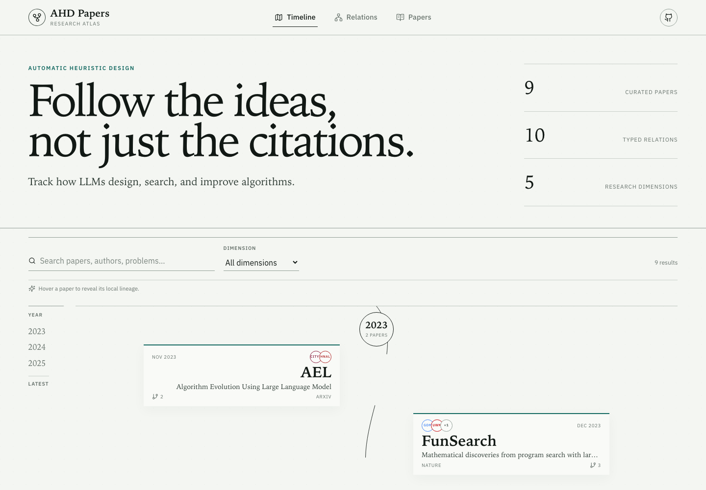

<div align="center">

# Awesome LLM4AD

**A living research atlas for automatic algorithm design with large language models.**

[](#seed-collection)
[](data/relations.yml)
[](LICENSE)
[](https://github.com/CIAM-Group/awesome-llm4ad/actions/workflows/deploy-pages.yml)

[Explore the atlas](https://ciam-group.github.io/awesome-llm4ad/) · [Browse papers](#seed-collection) · [Contribute](CONTRIBUTING.md)

</div>



## Why another awesome list?

Most paper lists answer **what exists**. AHD Papers also records **how the ideas connect**.

- A GitHub-readable Markdown note for every paper.
- A vertical research timeline based on the first public date.
- A typed relation graph with human-written explanations.
- Five controlled dimensions: history, design object, search, feedback, and scope.
- Optional institution marks with a text fallback—missing logos never block contributions.
- Static generation and GitHub Pages deployment with no backend or database.

> [!IMPORTANT]
> **AEL and FunSearch are represented as concurrent late-2023 work.** AEL appeared on arXiv on **26 November 2023**; FunSearch was published online in Nature on **14 December 2023**. The atlas records this chronology as an undirected `concurrent-work` relation. It does not create an EoH–FunSearch edge in the initial release.

## Seed collection

The first release intentionally starts small. Every entry has verified metadata, a structured research note, and a place in the atlas.

<!-- PAPER_TABLE:START -->
| Paper | First public | Venue | Primary lens | Resources |
|---|---:|---|---|---|
| [AEL](content/papers/ael/index.md) | 2023-11 | arXiv 2023 | Design object | [Paper](https://arxiv.org/pdf/2311.15249) |
| [FunSearch](content/papers/funsearch/index.md) | 2023-12 | Nature 2023 | Design object | [Paper](https://www.nature.com/articles/s41586-023-06924-6.pdf) · [Code](https://github.com/google-deepmind/funsearch) |
| [EoH](content/papers/eoh/index.md) | 2024-01 | ICML 2024 | Design object | [Paper](https://arxiv.org/pdf/2401.02051) · [Code](https://github.com/FeiLiu36/EoH) |
| [ReEvo](content/papers/reevo/index.md) | 2024-02 | NeurIPS 2024 | Feedback | [Paper](https://arxiv.org/pdf/2402.01145) · [Code](https://github.com/ai4co/reevo) |
| [HSEvo](content/papers/hsevo/index.md) | 2024-12 | AAAI 2025 | Search | [Paper](https://arxiv.org/pdf/2412.14995) · [Code](https://github.com/datphamvn/HSEvo) |
| [MCTS-AHD](content/papers/mcts-ahd/index.md) | 2025-01 | ICML 2025 | Search | [Paper](https://arxiv.org/pdf/2501.08603) · [Code](https://github.com/zz1358m/MCTS-AHD-master) |
| [AlphaEvolve](content/papers/alphaevolve/index.md) | 2025-06 | arXiv white paper 2025 | Scope | [Paper](https://arxiv.org/pdf/2506.13131) |
| [EoH-S](content/papers/eoh-s/index.md) | 2025-08 | AAAI 2026 | Scope | [Paper](https://arxiv.org/pdf/2508.03082) |
| [MLES](content/papers/mles/index.md) | 2025-08 | ICLR 2026 | Feedback | [Paper](https://arxiv.org/pdf/2508.05433) · [Code](https://github.com/QingL2000/MLES) |
<!-- PAPER_TABLE:END -->

## Read the field through four questions

1. **What is being designed?** A function, heuristic, heuristic set, policy, or larger code artifact?
2. **How does search improve it?** Population evolution, reflection, tree search, harmony search, or coding-agent orchestration?
3. **What feedback is trusted?** Scalar evaluation, verbal gradients, behavioral traces, or multiple evaluators?
4. **What transfers?** Across instances, distributions, problems, or full scientific and engineering systems?

## Repository structure

```text
content/papers/<paper-id>/
├── index.md                 # GitHub-readable note + YAML metadata
└── images/                  # Optional, attributed figures/screenshots

data/
├── institutions.yml        # One record per institution; logo optional
├── relations.yml           # Curated paper-to-paper relations
└── taxonomy.yml            # Controlled types and dimensions with guidance

src/                        # Timeline, relation graph, index, detail views
scripts/                    # Validation, content build, README generation
```

## Add a paper

1. Copy [`content/papers/_template/index.md`](content/papers/_template/index.md).
2. Use a stable lowercase ID such as `method-name`; do not add a year suffix.
3. Select existing values from [`data/taxonomy.yml`](data/taxonomy.yml).
4. Add images under the paper's local `images/` directory and cite their source.
5. Run the checks:

```bash
npm install
npm run validate
npm run readme
npm test
npm run build
```

arXiv papers and public white papers are welcome. Software-only projects without an accompanying paper are outside the paper collection.

## Local website

Node.js 20.19 or newer is required.

```bash
npm install
npm run dev
```

Open `http://localhost:5173`. The production build is written to `dist/` and deploys automatically to GitHub Pages from `main`.

## Citation

If this atlas helps your research, please cite the repository URL and star it so new readers can find the collection. Paper-specific citations should always refer to the original authors and venues.

## License

Repository code and original notes are available under the [Apache License 2.0](LICENSE). Paper figures remain the property of their original authors and publishers and are included only with explicit source attribution for scholarly navigation.
