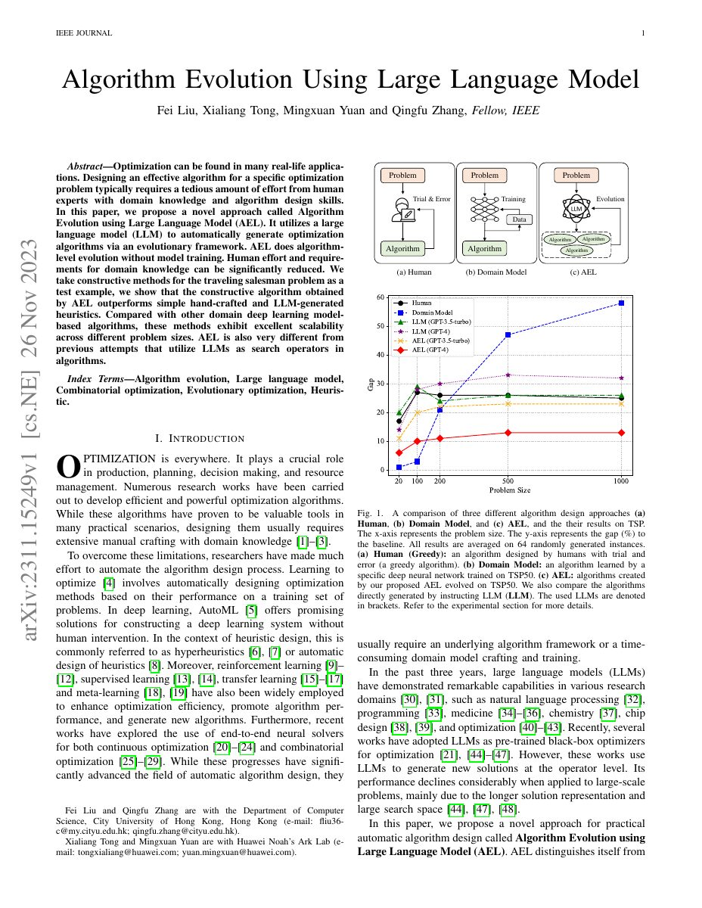

## Why it matters

Algorithm design traditionally depends on repeated manual experiments by people who understand both a problem domain and the mechanics of heuristic search. AEL asks whether an LLM can participate at the algorithm level: not merely tune a model or fill in a small code fragment, but propose and evolve complete optimization procedures.

The paper was publicly posted on arXiv on 26 November 2023. Together with FunSearch's December 2023 publication, it marks the early public emergence of LLM-guided evolutionary algorithm and program design. The chronology is represented as a concurrent-work relation rather than as a claim that one paper extends the other.

*Paper cover and opening figure. Source: Liu et al., AEL; included for research navigation and linked to the original paper.*

## Core method

AEL uses an evolutionary loop in which an LLM generates candidate algorithm ideas and executable implementations. Candidate algorithms are evaluated on optimization instances, selected according to their performance, and fed back into later generations. The LLM is therefore used as a proposal mechanism inside a measurable search process rather than treated as an unchecked oracle.

The initial demonstration focuses on constructive heuristics for the Traveling Salesman Problem. The generated algorithms are compared with simple hand-crafted rules, direct LLM-generated heuristics, and domain-specific learned solvers.

## Contributions

- It names and demonstrates algorithm evolution using LLMs as an explicit automatic-design setting.
- It searches at algorithm level without fine-tuning the language model.
- It highlights scalability across problem sizes as a desirable property of generated constructive algorithms.

## Strengths and limitations

The most important strength is conceptual clarity: a candidate is an executable algorithm with measurable behavior, not only a text answer. The main limitations are a narrow initial problem family, reliance on evaluator design, and limited analysis of how the evolutionary representation controls diversity and credit assignment.

Future work can separate the algorithm object from the search controller, test transfer across task distributions, and record behavioral as well as objective similarity between candidates.

## Connections

See the [concurrent-work relation with FunSearch](/relations/) and the later EoH extension in the research map.
