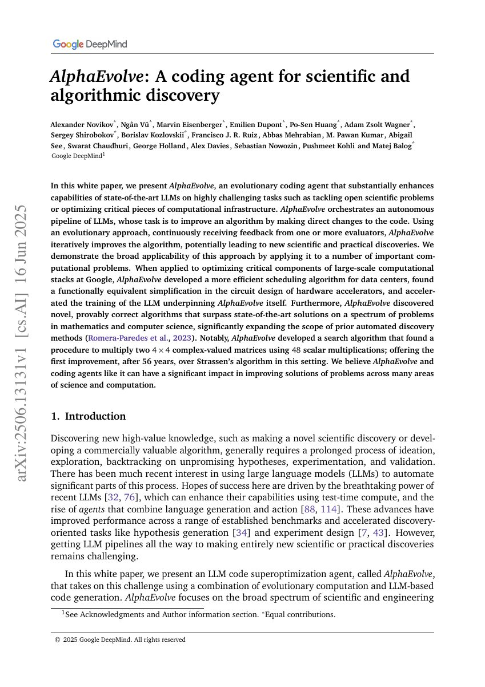

## Why it matters

AlphaEvolve makes the system boundary larger than a single heuristic function. An autonomous pipeline of language models proposes direct code changes, evaluators measure them, and the search continues across longer-lived algorithmic artifacts. The paper describes a white-paper system rather than a conventional conference submission, so the atlas labels it accurately.

*Paper cover and opening figure. Source: Novikov et al., AlphaEvolve; see the [arXiv white paper](https://arxiv.org/abs/2506.13131).*

## Core method

AlphaEvolve orchestrates coding agents, evolutionary selection, and one or more evaluators. Candidates are executable programs, and the harness can apply domain-specific correctness and performance checks. The paper reports applications to data-center scheduling, accelerator circuits, LLM training infrastructure, mathematical algorithms, and matrix multiplication.

## Contributions

- A general coding-agent architecture for evaluator-guided algorithm evolution.
- Evidence that evolutionary code editing can target both scientific and production systems.
- A broad system-level framing of automatic discovery beyond fixed heuristic templates.

## Strengths and limitations

The executable artifact and evaluator make the loop concrete, while the wider system boundary enables real engineering impact. Reproducibility is limited by proprietary models, infrastructure, evaluators, and compute. Long-horizon evolution also makes harness safety, budget allocation, and anti-hacking checks central research concerns.

## What to improve

Open implementations, transparent evaluation harnesses, and standardized budgets would make comparisons with academic AHD systems more meaningful.

## Connections

The atlas treats AlphaEvolve as a system-level generalization of evaluator-guided program search, including FunSearch as its closest historical anchor.
