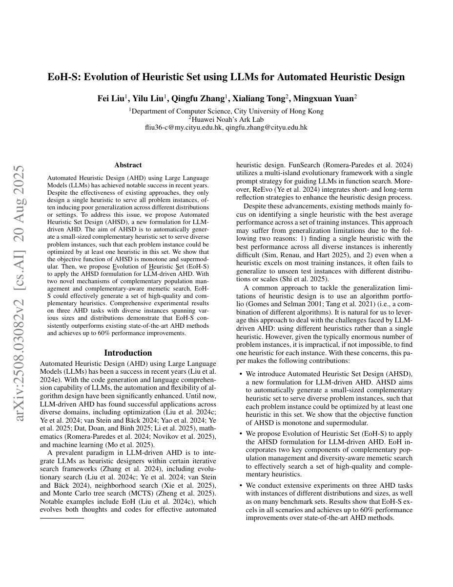

## Why it matters

Most automatic heuristic design systems return one heuristic that must serve every test instance. A single winner can perform well on the training distribution while failing on a shifted size, geometry, or constraint distribution. EoH-S changes the objective: design a small set of complementary heuristics and let each instance use its strongest member.

*Paper cover and opening figure. Source: Liu et al., EoH-S; see the [arXiv paper](https://arxiv.org/abs/2508.03082).*

## Core method

The paper introduces automated heuristic set design and studies its monotone, supermodular objective. EoH-S adds complementary population management and complementary-aware memetic search to an LLM-driven evolutionary framework. The final set is evaluated by whether its members cover different instances rather than by the score of a single global champion.

Experiments span online bin packing, TSP, and CVRP across multiple sizes and distributions, with explicit comparisons to single-heuristic methods.

## Contributions

- A problem formulation that treats a heuristic set as the design artifact.
- Complementarity-aware population management and local search.
- A direct attack on distribution shift and instance-level generalization.

## Strengths and limitations

The formulation better matches real systems that see heterogeneous instances and makes “generalization” measurable through coverage. It also creates a harder credit-assignment problem: a candidate that is not globally best may still be essential to the set.

## What to improve

Future work should make set size cost-aware, learn a fast instance-to-heuristic selector, and report behavioral diversity alongside objective complementarity.

## Connections

EoH-S is modeled as a generalization of the single-heuristic EoH design object. Its main distinction is not a new prompt alone, but the change in what counts as a successful algorithm.
