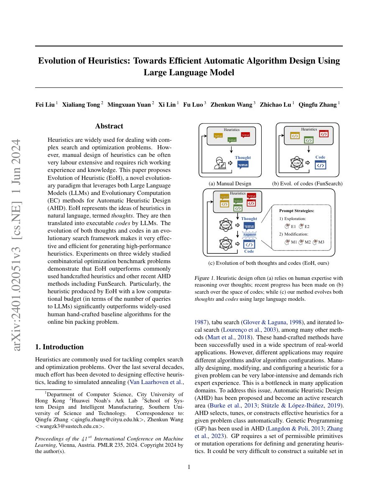

## Why it matters

Hand-designed heuristics encode years of domain experience but are expensive to create and difficult to transfer. EoH makes the design object explicit: a heuristic has a natural-language idea, or “thought,” and an executable implementation. Both can evolve instead of treating code generation as a one-off step.

*Paper cover and opening figure. Source: Liu et al., EoH; see the [ICML version](https://proceedings.mlr.press/v235/liu24bs.html).*

## Core method

The framework alternates between exploration and exploitation operators. The LLM generates a thought, translates it into code, and evaluates the resulting heuristic. Strong candidates provide material for later prompts, while the evolutionary population keeps multiple candidate ideas alive. The algorithm therefore searches in a mixed space of language-level reasoning and executable behavior.

Experiments cover TSP, online bin packing, and flow-shop scheduling. EoH reports strong results under a relatively small number of LLM queries and studies how generated heuristics compare with hand-crafted baselines and other AHD systems.

## Contributions

- A co-evolutionary representation that keeps ideas and code connected.
- Explicit exploration/exploitation prompt strategies for LLM-based AHD.
- An empirical demonstration across several combinatorial optimization tasks.

## Strengths and limitations

The thought/code split gives researchers a useful explanation surface and makes the evolutionary operators easier to discuss. It can also create duplicated or syntactically different candidates with similar behavior. Performance remains sensitive to the evaluator, prompt operators, population management, and task-specific scaffold.

## What to improve

Useful next steps include behavioral deduplication, cross-task representations, budget-aware search, and a clearer separation between structure discovery and parameter tuning.

## Connections

EoH is connected to AEL as a later representation extension. The atlas intentionally does not create a direct EoH–FunSearch edge in the first release.
