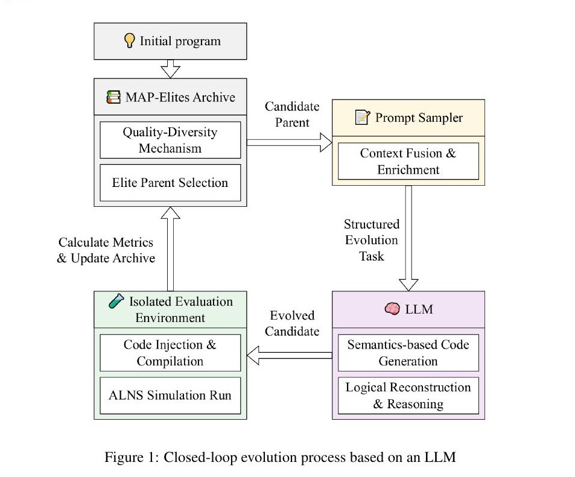
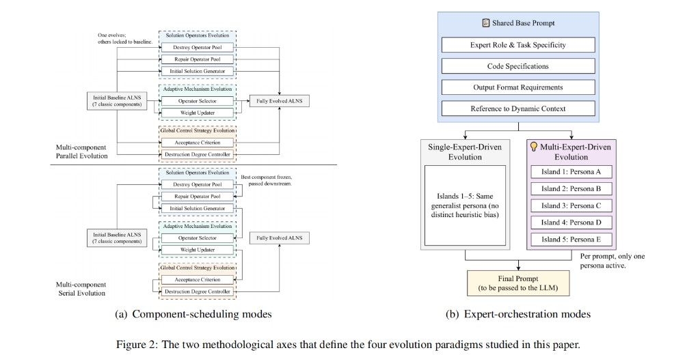

## Why it matters

ALNS couples operators with adaptive and control logic that is usually hand-crafted. Prior LLM-AHD often evolves only destroy or repair operators and freezes higher layers. Strong operators can still be limited by static weights, acceptance rules, or destruction schedules.

## Core method

ALNS is split into three layers and seven modules, each evolved in a generate–evaluate–feedback loop.

*MAP-Elites sampling, prompt assembly, LLM generation, and isolated ALNS evaluation. Source: Yu et al., Evolved-ALNS, Figure 1; see the [arXiv paper](https://arxiv.org/abs/2603.06996).*

- **Solution operations:** initial solution, destroy pool, repair pool.
- **Adaptive mechanism:** operator selector, weight updater.
- **Global controls:** acceptance criterion, destruction-degree controller.

MAP-Elites keeps quality and diversity. Isolated evaluators score one module while others stay fixed; cascade evaluation screens cheaply before full runs. Elites are then assembled into full Evolved-ALNS solvers.

Four paradigms arise from two axes:

*Parallel vs serial scheduling, and single- vs multi-expert prompting. Source: Yu et al., Evolved-ALNS, Figure 2; see the [arXiv paper](https://arxiv.org/abs/2603.06996).*

- **Parallel:** all modules evolve concurrently; non-targets locked to baseline (fast, weaker coupling awareness).
- **Serial:** evolve and freeze upstream elites before downstream tasks (captures layer dependence).
- **Single-expert:** one shared generalist persona.
- **Multi-expert:** islands use distinct domain personas; one persona active per prompt.

## Contributions

- Full-pipeline LLM evolution for ALNS, covering operators plus adaptive and control layers.
- Systematic comparison of the four paradigms under fixed-iteration and fixed-time budgets.
- Gains over tuned Baseline-ALNS on TSPLIB and CVRPLIB, with transfer and code-pattern analysis.

## Strengths and limitations

The full-stack view matches ALNS as a coupled system and yields interpretable patterns. Strong isolated modules need not compose into the best full algorithm; the best paradigm is problem- and budget-dependent; offline evolution is expensive.

## What to improve

Joint co-evolution of interacting modules, cheaper evaluators, and reusable Evolved-ALNS releases.

## Connections

Evolved-ALNS expands LLM-AHD from local operators to a complete ALNS stack. The atlas records a generalization of EoH along design-object.
