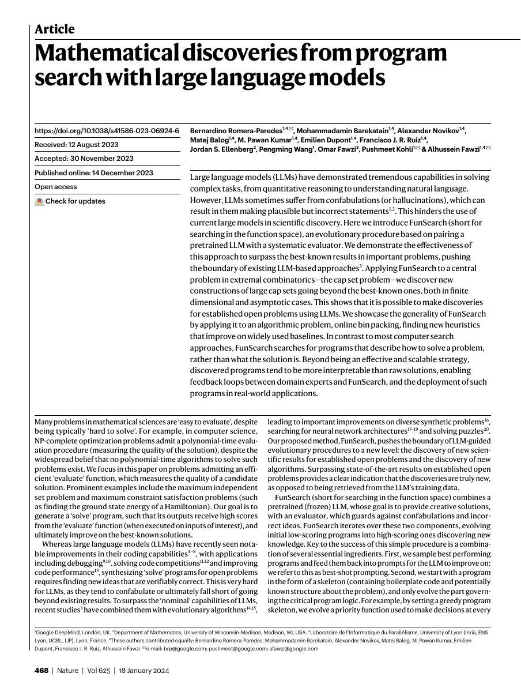

## Why it matters

Large language models can propose plausible but incorrect ideas. FunSearch addresses that weakness by coupling creative program proposals to an evaluator that decides whether a candidate actually works. The result is an evolutionary procedure that searches for executable programs instead of asking an LLM to state a final answer directly.

*Paper cover and opening figure. Source: Romera-Paredes et al., FunSearch; see the original [Nature article](https://www.nature.com/articles/s41586-023-06924-6).*

## Core method

FunSearch starts with a program skeleton and evolves the part containing the problem-specific logic. A frozen pretrained LLM proposes mutations using best-performing programs as examples. The evaluator executes each candidate and returns an objective score, allowing an evolutionary database to preserve high-performing discoveries and revisit promising branches.

The paper demonstrates the approach on the cap set problem in extremal combinatorics and on online bin packing. The latter is particularly relevant to LLM4AD because the output is an interpretable heuristic program rather than a raw solution vector.

## Contributions

- A reusable LLM-plus-evaluator evolutionary procedure for program search.
- Demonstrations that search can produce new mathematical constructions beyond the model's nominal answer.
- An algorithmic application that discovers improved online bin-packing heuristics.

## Strengths and limitations

The evaluator gives the loop a verifiable feedback channel and the program representation makes discoveries inspectable. The approach still depends on a good skeleton, an efficient evaluator, and a search budget. It also leaves open how to move from a single task-specific program to a transferable algorithm system.

## Connections

The atlas places FunSearch beside AEL as a late-2023 concurrent work. Later systems can be explored through the `system`, `search`, and `feedback` filters.
