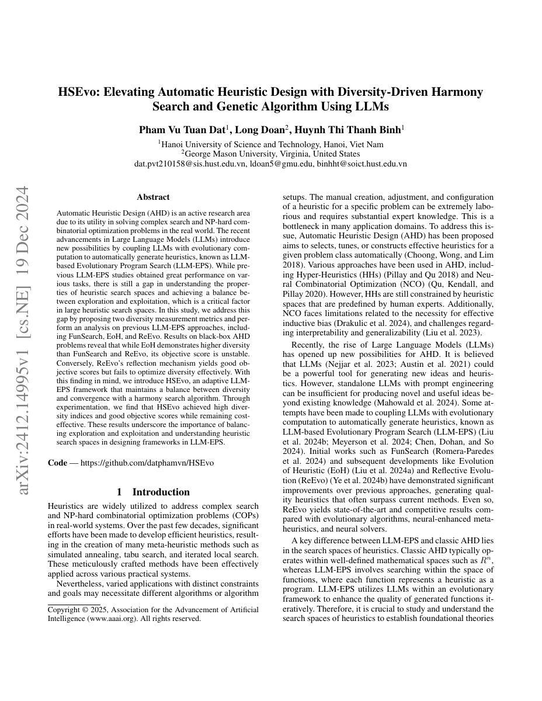

## Why it matters

High objective scores can hide a collapsed search space. If the population contains many syntactic variants of the same behavior, later generations may have little room to discover a genuinely different algorithm. HSEvo makes diversity itself a first-class object of analysis.

*Paper cover and opening figure. Source: Dat et al., HSEvo; see the [arXiv paper](https://arxiv.org/abs/2412.14995).*

## Core method

HSEvo proposes diversity measures for heuristic search spaces, analyzes previous LLM evolutionary methods, and combines harmony search with a genetic algorithm. The design aims to keep candidates sufficiently different while still improving their objective scores. Its experiments explicitly compare the diversity and performance behavior of FunSearch, EoH, and ReEvo.

## Contributions

- A measurable exploration–exploitation lens for LLM-based heuristic search.
- Diversity-driven harmony-search operations inside an LLM evolutionary loop.
- Empirical analysis of why high objective quality and high search diversity can diverge.

## Strengths and limitations

The paper gives the community language and metrics for discussing a problem that is easy to miss in leaderboard-only comparisons. Diversity metrics may still be representation-dependent, and maintaining diversity can increase evaluation cost or preserve low-quality branches.

## What to improve

Behavioral trajectory similarity, task-transfer tests, and budget-normalized Pareto fronts would make diversity claims more robust across code representations and problems.

## Connections

HSEvo evaluates the exploration behavior of EoH, ReEvo, and FunSearch; those are separate typed relations rather than a single undifferentiated “similar” tag.
