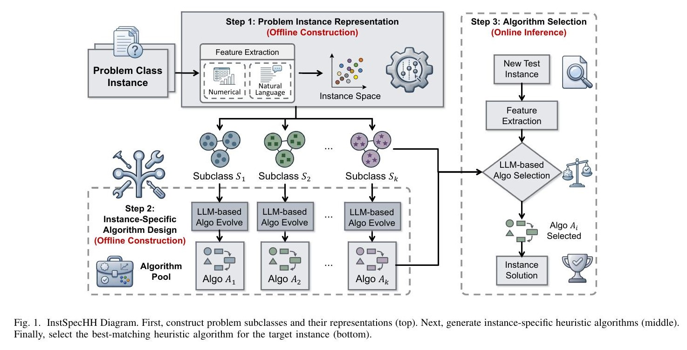
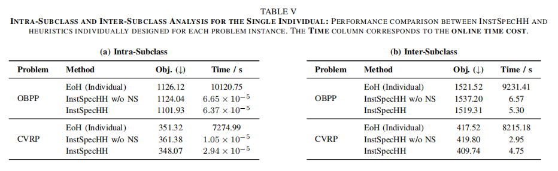

## Why it matters

Mainstream LLM + evolutionary AHD is problem-specific: one global heuristic for all instances. That ignores heterogeneity. On diverse tests the single heuristic often falls back to handcrafted baselines such as Best Fit, while per-instance evolution is too expensive.

Example: online bin packing with 500 items and capacity 100. Uniform sizes favor Best Fit; normal sizes favor residuals near the mean. One shared heuristic cannot serve both.

## Core method

InstSpecHH pairs costly offline construction with cheap online routing.

*Offline subclass construction and heuristic generation, then online algorithm selection. Source: Zhang et al., InstSpecHH, Figure 1; see the [arXiv paper](https://arxiv.org/abs/2506.00490).*

1. **Representation (offline).** Discrete features describe each instance numerically and in natural language.
2. **Subclasses (offline).** Feature combinations define subclasses; identical feature vectors share one subclass.
3. **Heuristic design (offline).** An LLM evolutionary loop yields one strong heuristic per subclass; neighbor search borrows nearby elites into an algorithm pool.
4. **Selection (online).** An LLM or a small MLP routes a new instance to a stored heuristic.

Similar instances share one heuristic, so offline cost amortizes across many online queries.

## Contributions

- Makes instance heterogeneity an explicit design target instead of one class-wide winner.
- Offline–online pipeline: feature subclasses, subclass evolution with neighbor search, and LLM/NN routing.
- Strong intra- and inter-subclass results on OBPP and CVRP, matching or beating per-instance EoH at much lower online cost.

*Table V: quality vs per-instance EoH, with online time cut by orders of magnitude. Source: Zhang et al., InstSpecHH, Table V; see the [arXiv paper](https://arxiv.org/abs/2506.00490).*

## Strengths and limitations

The subclass library is reusable, but quality hinges on the hand-chosen features and the selector. Offline generation remains expensive; code release was promised rather than linked at submission.

## What to improve

Learned features, cheaper subclass search, and a published selector-plus-pool release.

## Connections

InstSpecHH keeps LLM heuristic generation from EoH-style lines, but shifts from one class-wide winner to subclass generation and selection. The atlas records this as a generalization of EoH along scope.
