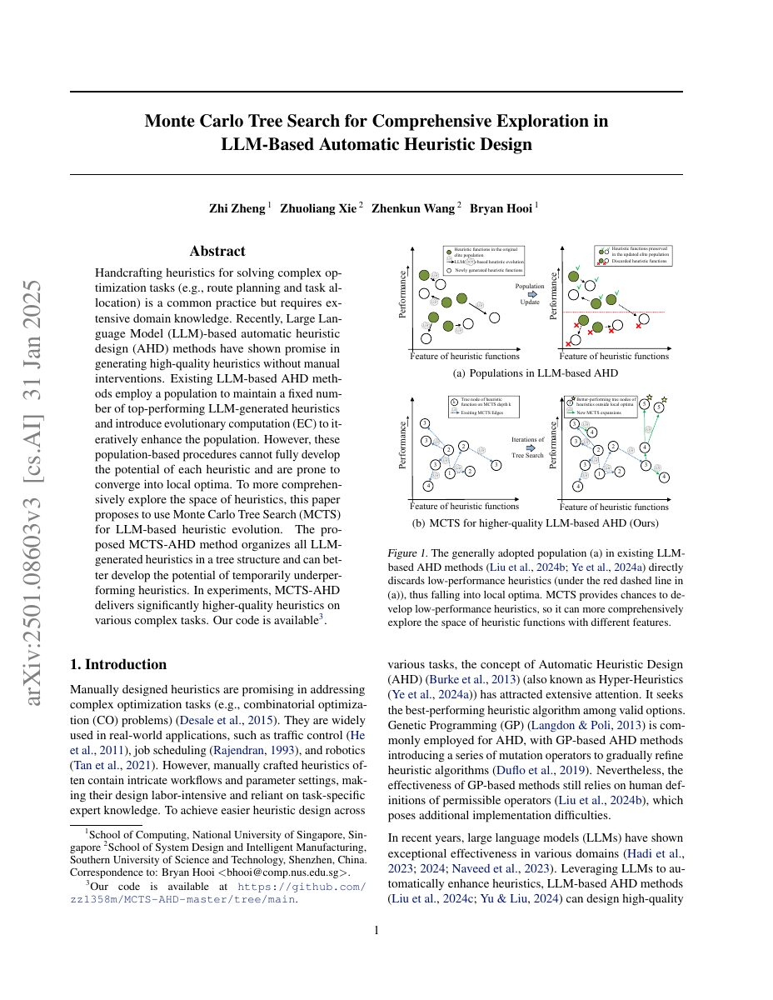

## Why it matters

Population-based LLM-AHD systems often preserve only the current elite candidates. That makes the search efficient but can discard a promising branch before its idea has been properly developed. MCTS-AHD treats the history of generated heuristics as a navigable tree.

*Paper cover and opening figure. Source: Zheng et al., MCTS-AHD; see the [arXiv paper](https://arxiv.org/abs/2501.08603).*

## Core method

Each heuristic is a node in a Monte Carlo tree. Selection balances exploitation of strong branches with exploration of less-visited branches; expansion asks the LLM to generate a new candidate; evaluation updates node statistics. The tree preserves ancestry and makes it possible to return to an underperforming parent whose descendants may still contain useful design directions.

The paper evaluates the approach across several combinatorial optimization tasks and compares it with earlier LLM-AHD population procedures.

## Contributions

- A tree-structured history for LLM-based heuristic evolution.
- Explicit exploration of candidate lineages instead of only the current elite set.
- A search-controller perspective on improving automatic heuristic design.

## Strengths and limitations

Lineage preservation is useful for analysis and for recovering ideas lost by aggressive truncation. Tree growth can become expensive, and node statistics remain tied to noisy, task-specific evaluators. The method also raises a broader question: which branch is worth developing when early objective scores are unreliable?

## What to improve

Graph-based memory, behavior-aware similarity, and adaptive evaluation budgets could help the tree allocate compute to candidates whose potential is not visible in a single score.

## Connections

MCTS-AHD is a search-level contrast to population-centered AHD systems and appears in the atlas as a branch from the EoH research line.
