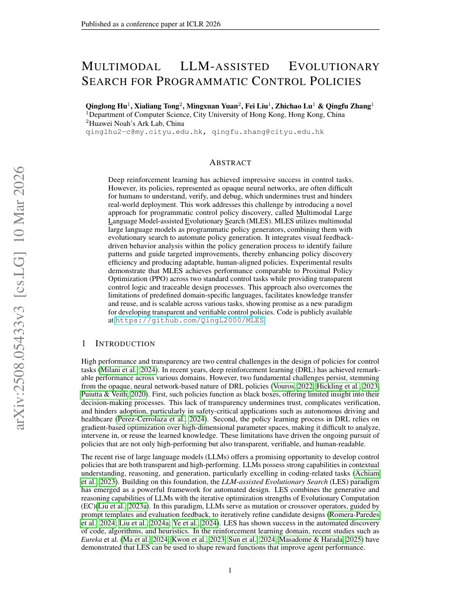

## Why it matters

Learned control policies can be powerful but opaque. Scalar rewards alone often do not explain why a policy fails, which makes targeted improvement difficult. MLES uses a multimodal LLM to inspect execution traces and visual behavior while evolving programmatic policies that remain readable and executable.

*Paper cover and opening figure. Source: Hu et al., MLES; see the [arXiv paper](https://arxiv.org/abs/2508.05433).*

## Core method

MLES runs a closed evolutionary loop over policy programs. The evaluator returns objective performance and visual rollouts; the multimodal model analyzes behavior and proposes targeted modifications. The reported instantiation uses an EoH-style evolutionary backbone, shares comparable initial populations, and adds visual feedback-driven behavior analysis.

The paper evaluates LunarLander and CarRacing, comparing programmatic policies with reinforcement-learning baselines and an evolution loop without the visual analysis component.

## Contributions

- A general multimodal evolutionary search framework for executable policies.
- Behavior-level visual feedback in addition to scalar rewards.
- A bridge between automatic heuristic design and interpretable control-program discovery.

## Strengths and limitations

Visual feedback can expose failure modes that a scalar score hides and gives the LLM a richer mutation signal. The approach introduces multimodal inference cost and depends on the quality of rendered traces, behavior descriptions, and evaluator design.

## What to improve

Behavior embeddings, automatic failure-mode taxonomies, and cross-task policy transfer could make the visual feedback channel less dependent on prompt wording.

## Connections

MLES adapts an EoH-like evolutionary backbone to programmatic control, demonstrating how the same search ideas can cross from combinatorial heuristics into multimodal policy discovery.
