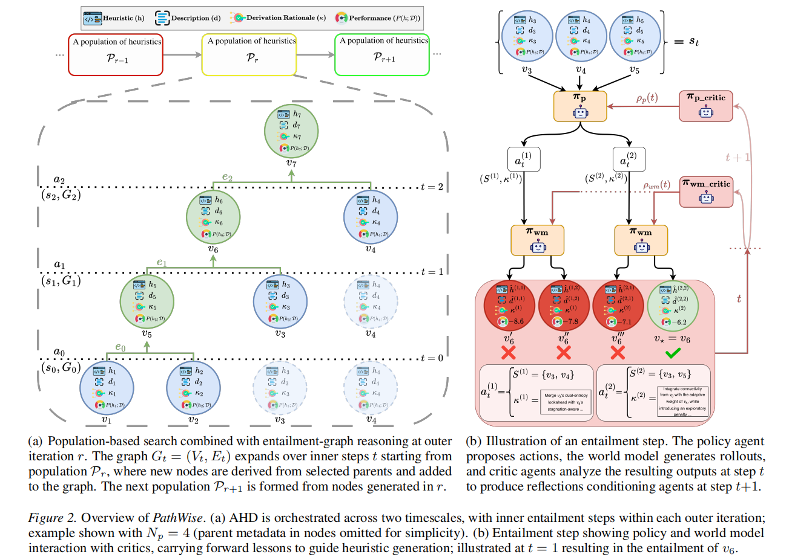

## Why it matters

Existing LLM-based AHD methods rely on fixed evolutionary rules and static prompt templates, leading to myopic generation, redundant evaluations, and limited reasoning about heuristic derivation. PathWise introduces a stateful, semantic representation of the search trajectory and a planning-based approach to overcome these limitations.

*Overview of PathWise. Source: Oguzhan Gungordu et al., PathWise; included for research navigation and linked to the original paper.*

## Core method

PathWise is a multi-agent framework that constructs an entailment graph encoding derivation history. A policy agent selects parent heuristics and proposes natural-language derivation rationales, a world model agent generates code-level heuristic rollouts conditioned on these actions, and two critic agents analyze the results to produce routed reflections that guide subsequent planning and code synthesis. The process is complemented by prompt-level diversity mechanisms and a leaf-first population update.

## Contributions

Introduces a hybrid graph-based and population-based formulation of heuristic evolution via an entailment graph that captures derivation cand performance history.
Proposes a coordinated multi-agent LLM framework with policy, world model, and critic agents that enables state-aware, self-evolving heuristic generation.
Incorporates prompt-level diversity through perturbation and state shuffling to promote broader exploration.
Demonstrates consistent improvements over state-of-the-art LLM-based AHD methods across multiple combinatorial optimization problems, with faster convergence and strong scalability.

## Strengths and limitations

Strengths: faster convergence, better heuristic quality, strong cross-problem generalization, and robust performance across different LLM backbones. Limitations: the approach is training-free but still incurs substantial LLM API costs; the multi-agent coordination and graph maintenance add complexity; performance depends on the reasoning capabilities of the underlying LLM and the quality of the predefined search frameworks.

## What to improve

Extend the framework to support a wider range of search frameworks beyond constructive, ACO, and GLS.
Investigate methods to adapt the entailment graph representation to other types of design objects, such as algorithm portfolios or hyperparameter configurations.
Evaluate on more complex, real-world problems with larger instance sizes and dynamic constraints.

## Connections

PathWise extends the population-based design of EoH and ReEvo by replacing fixed operators and static reflection with a stateful entailment graph and planning-driven agent interactions. It contrasts with tree-based methods like MCTS-AHD by adopting a semantic, rationale-based exploration strategy instead of performance-driven UCT scores. The critic-driven feedback mechanism generalizes the single-level reflection of ReEvo into separate policy and world model critics, while the graph memory provides a more structured alternative to the unbounded tree of MCTS-AHD.
