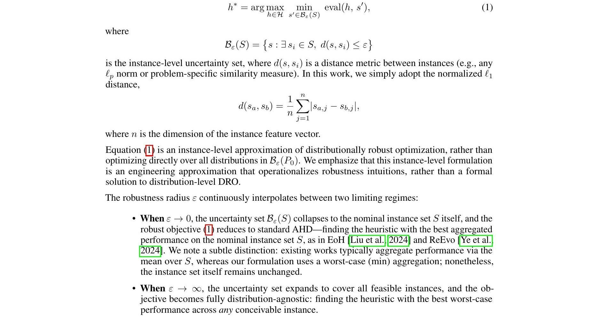
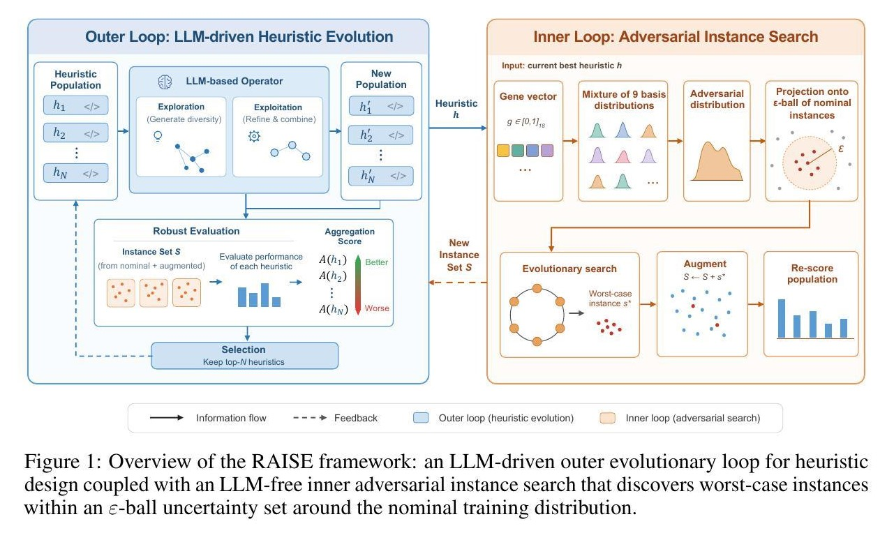
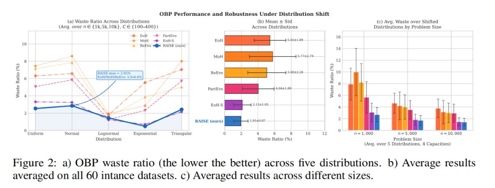

## Why it matters

Methods such as EoH and ReEvo fit a fixed training set and can fail under distributional shift. EoH-S and MoH add more training distributions for coverage, but diverse corpora are hard to enumerate and costly to evaluate. RAISE keeps a small nominal set and searches for nearby worst-case instances during evolution.

## Core method

Robust AHD is cast as a constrained minimax over an epsilon-ball around the nominal set S: outer maximize heuristic quality; inner minimize on hard instances in that ball. This is a practical instance-level stand-in for distributionally robust optimization.

*Equation 1: epsilon near 0 recovers standard AHD on S; larger epsilon forces worse-case robustness. Source: Liu et al., RAISE; see the [arXiv paper](https://arxiv.org/abs/2606.31801).*

*LLM outer evolution plus LLM-free inner adversarial search. Source: Liu et al., RAISE, Figure 1; see the [arXiv paper](https://arxiv.org/abs/2606.31801).*

- **Outer loop.** EoH-style LLM evolution under the current adversarial instance set.
- **Inner loop.** LLM-free search finds a worst-case instance for the current best heuristic: an 18-d gene mixes nine basis distributions, then projects onto the epsilon-ball boundary. The hard instance augments S and the population is re-scored.

## Contributions

- Instance-level robust AHD over an epsilon-ball, as an operational DRO-style objective for LLM-AHD.
- Bi-level RAISE: LLM outer evolution with LLM-free adversarial search (basis mixture + boundary projection).
- Strong OOD results on OBP, OJSP, and OVRP from five nominal instances; prior LLM-AHD methods can degrade sharply (up to about 19× on some OBP settings).

*Figure 2: OBP waste under shift across distributions, aggregate mean±std, and size averages. Source: Liu et al., RAISE, Figure 2; see the [arXiv paper](https://arxiv.org/abs/2606.31801).*

## Strengths and limitations

The inner loop adds robustness without extra LLM queries and avoids large multi-distribution training pools. Results still depend on epsilon, the basis mixture, and how well the adversarial search covers the ball.

## What to improve

Adaptive epsilon, richer bases, and an open adversarial-search release.

## Connections

RAISE targets the same robustness gap as EoH-S, but searches for nearby worst-case instances instead of relying on a fixed diverse training pool. The atlas records a contrast with EoH-S along scope.
