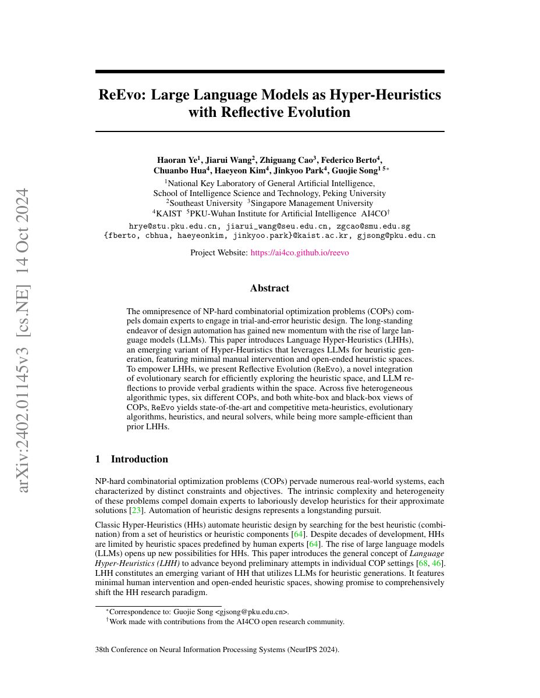

## Why it matters

Evolution can preserve high-scoring candidates without explaining how to improve a weak one. ReEvo adds a reflective channel that turns evaluation outcomes into natural-language feedback. It frames the broader research direction as language hyper-heuristics: LLMs generate heuristics in an open-ended space with little manual definition of the search space.

*Paper cover and opening figure. Source: Ye et al., ReEvo; see the [project repository](https://github.com/ai4co/reevo).*

## Core method

ReEvo maintains a population of generated heuristics and uses an LLM to reflect on candidate behavior. Short-term reflections focus on recent search outcomes; long-term reflections accumulate lessons that can guide later generations. The resulting verbal gradients complement objective scores and help the search move through a large open-ended heuristic space.

The paper evaluates multiple algorithm types and combinatorial optimization problems, including both white-box and black-box settings. The emphasis is on broad applicability and LLM query efficiency rather than a single handcrafted heuristic template.

## Contributions

- The language hyper-heuristic framing for LLM-generated heuristics.
- Reflective evolution with short- and long-term memory.
- Broad experiments across problem types, COPs, and solver visibility settings.

## Strengths and limitations

Reflection provides a human-readable search trace and a natural way to turn failure into a next-step suggestion. Its quality depends on the fidelity of the reflection prompt and the evaluator feedback. Reflection can also concentrate the population too quickly if diversity is not measured explicitly.

## What to improve

Future systems should combine reflection with behavioral diversity, tree or archive-based exploration, and explicit compute accounting so that verbal improvement does not hide expensive trial-and-error.

## Connections

The atlas treats ReEvo as an extension of the feedback channel in the AHD line and links forward to HSEvo's analysis of diversity versus objective quality.
